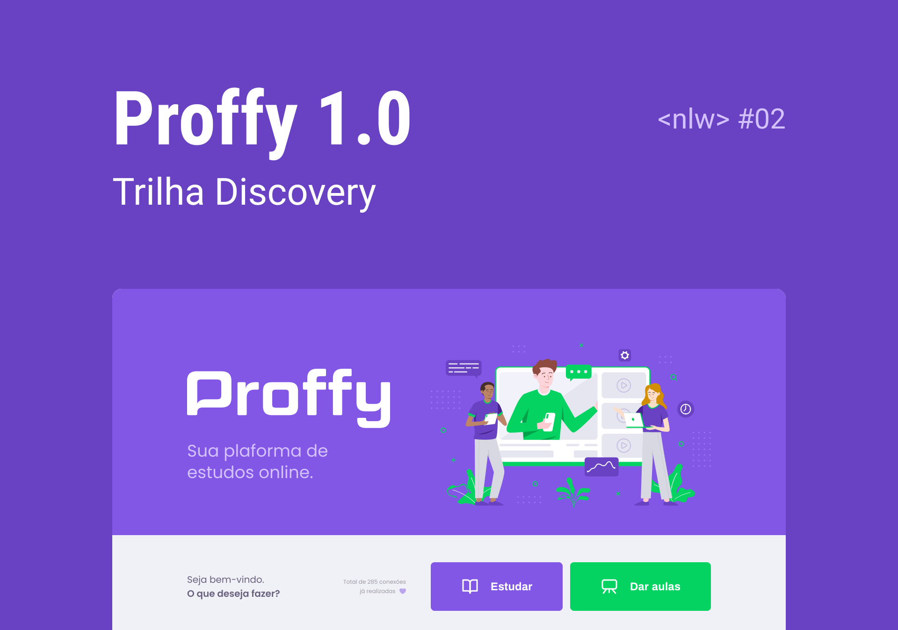

Esse projeto foi desenvolvido durante a semana NEXT LEVEL WEEK #2 da [Rocketseat](https://rocketseat.com.br). Sobre a mentoria de [Diego Fernandes](https://github.com/diego3g). O Proffy é uma plataforma de estudos online que ajuda pessoas a encontrarem professores online. 👨🏾‍🏫👩🏾‍🎓

⚙ **Tecnologias Utilizadas**

- [Node.js](https://nodejs.org/en/)
- [React](https://reactjs.org/)
- [React Native](https://reactnative.dev/)
- [Expo](https://expo.dev/)
- [Typescript](https://www.typescriptlang.org/)